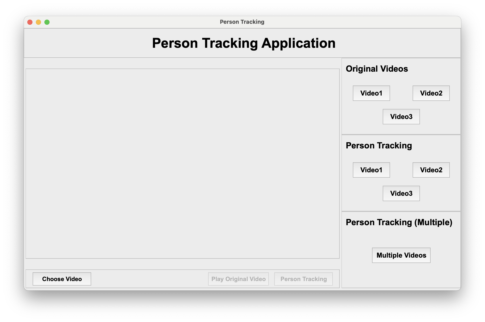
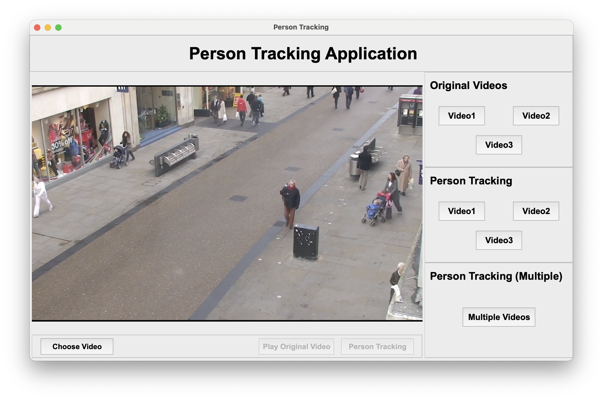
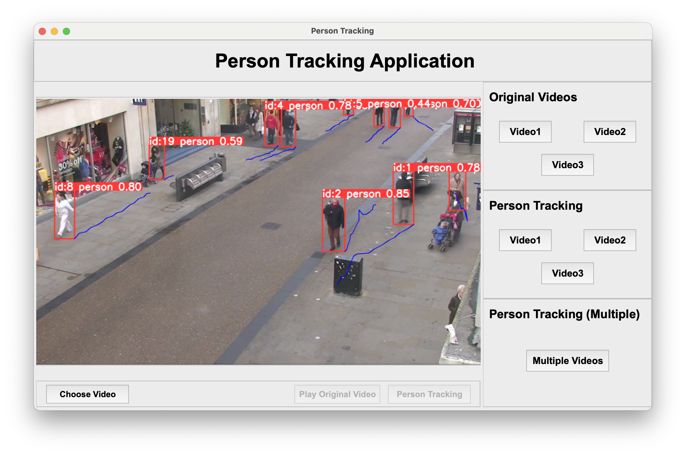
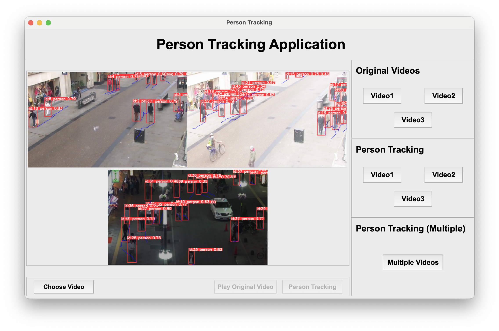

# Computer Vision Coursework
This is Yuening XIE (20318143)'s Computer Vision coursework.

## How to use

The project relies on several key Python libraries for its functionality. Below are the libraries along with their versions:

- PyQt5 5.15.10
- Numpy 1.26.2
- OpenCV 4.9.0
- Ultralytics 8.2.7

After installing these libraries, just run the `start.py` file to start the application.

## Snapshots of the System

